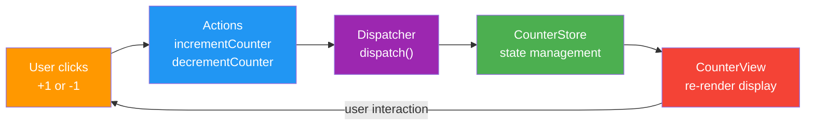

<p align="center">
  <h1 align="center">neon_counter_app_with_flux_architecture</h1>
  <p align="center">
    A neon-themed counter application built with vanilla JavaScript demonstrating the Flux architecture pattern — increment, decrement, and learn unidirectional data flow.
  </p>
</p>

<p align="center">
  <a href="https://github.com/girijashankarj/neon_counter_app_with_flux_architecture"></a>
  
  
  
  
</p>

---

## Table of Contents

- [Overview](#overview)
- [Features](#features)
- [Flux Architecture](#flux-architecture)
- [Quick Start](#quick-start)
- [Project Structure](#project-structure)
- [How It Works](#how-it-works)
- [Contributing](#contributing)
- [License](#license)

---

## Overview

**neon_counter_app_with_flux_architecture** is an educational project that demonstrates the Flux architecture pattern using a simple counter. It uses vanilla JavaScript — no frameworks — to show how Actions, a Dispatcher, a Store, and a View work together to create predictable, unidirectional data flow. The neon cyan/pink theme makes it visually striking.

---

## Features

- **Increment** — add 1 to the counter
- **Decrement** — subtract 1 from the counter
- **Neon theme** — cyan and pink glow effects
- **Pure Flux** — Dispatcher, Store, Actions, View — no frameworks
- **Single file** — entire app in one HTML file for easy learning

---

## Flux Architecture



**Why Flux?**
- **Predictable data flow** — one-way data movement
- **Centralized state** — single source of truth
- **Separation of concerns** — clear roles for each layer
- **Easier debugging** — traceable state changes

---

## Quick Start

```bash
git clone https://github.com/girijashankarj/neon_counter_app_with_flux_architecture.git
cd neon_counter_app_with_flux_architecture
```

Open `neon_counter_app_with_flux_architecture.html` directly in your browser — no build step required.

---

## Project Structure

```
neon_counter_app_with_flux_architecture/
├── neon_counter_app_with_flux_architecture.html    # Single-file app
└── README.md
```

---

## How It Works

| Layer          | Responsibility                                    |
| -------------- | ------------------------------------------------- |
| **Actions**    | Create action objects (`INCREMENT`, `DECREMENT`)  |
| **Dispatcher** | Central hub — receives actions, notifies store    |
| **Store**      | Holds counter state, processes dispatched actions |
| **View**       | Renders the counter, listens for store changes    |

The entire implementation lives in a single HTML file with embedded JavaScript and CSS — making it easy to read, modify, and learn from.

---

## Contributing

1. **Fork** the repository
2. **Create** a feature branch: `git checkout -b feature/my-feature`
3. **Make** your changes
4. **Commit** and open a Pull Request

---

## License

This project is open source. See the [LICENSE](LICENSE) file for details.

---

<p align="center">
  Built with discipline by <a href="https://github.com/girijashankarj">GarryTJ</a>
</p>
